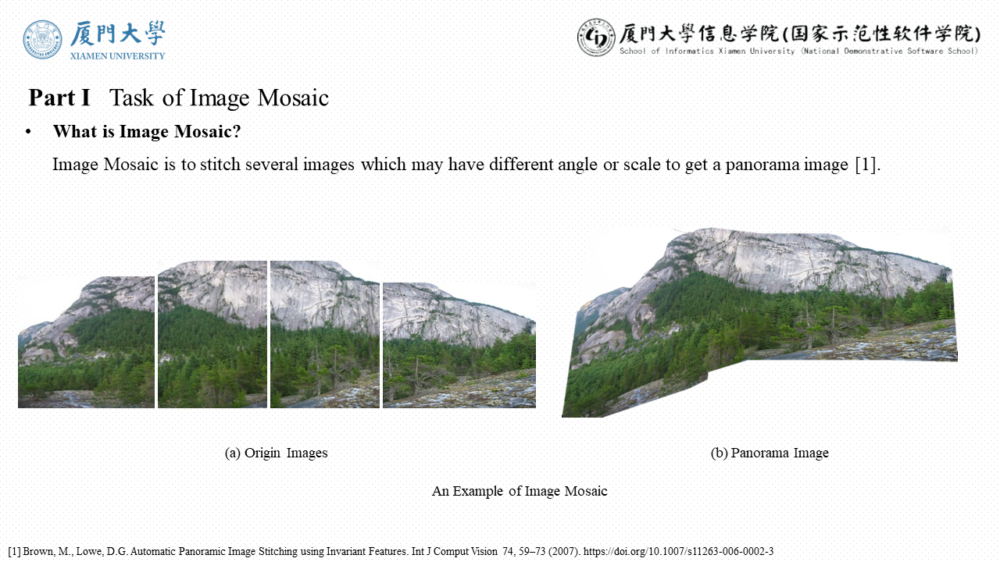
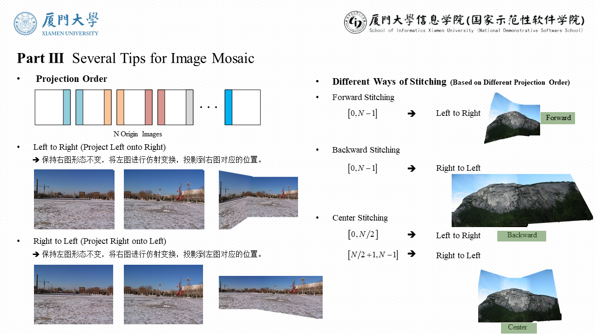
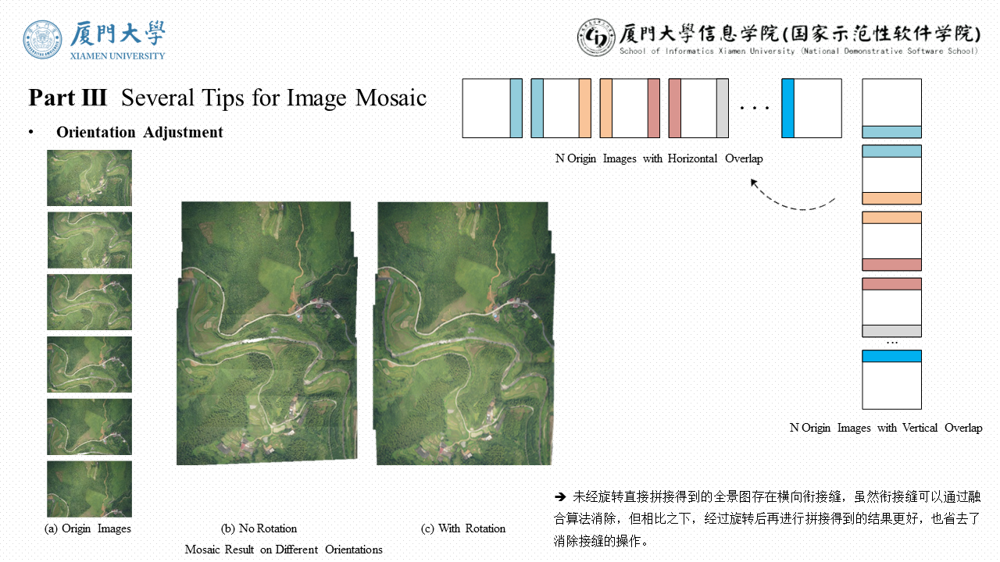
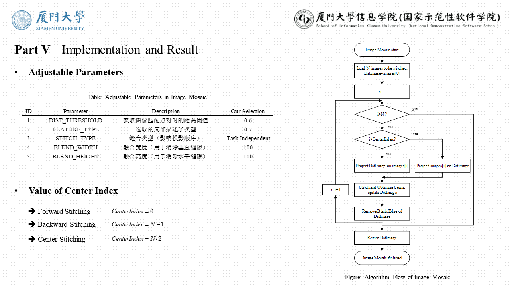
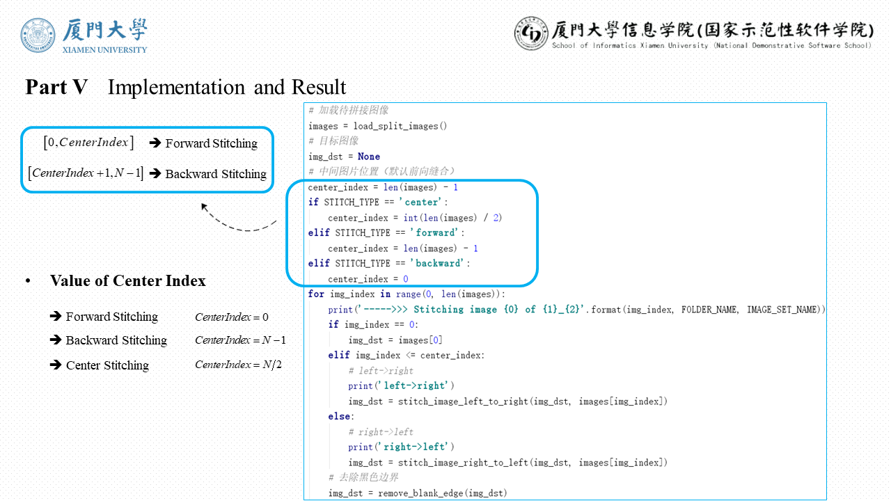

# Image Mosaic Based on Local Feature and RANSAC

This project is an implementation of image mosaic based on local feature descriptors and RANSAC, coded in Python language.

Image mosaic is to make a panorama from given images.

## Project Structure

+ Runnable Python source file is [ImageMosaic.py](./ImageMosaic.py), implemented with SIFT/SURF/ORB and RANSAC algorithm.
JUST CLONE THE REPOSITORY AND RUN IT!
+ Images to be stitched are in [dataset](./dataset) directory, which contains 2 types, one is [translation](./dataset/translation), another is [rotate-scale](./dataset/rotate-scale).
+ The [output](./output) directory contains panorama results generated by [ImageMosaic.py](./ImageMosaic.py). Images in the [unblend](./output/unblend) directory are the mosaic results without seam elimination.

## I. Task of Image Mosaic 
  
  
  
## II. Principle of Image Mosaic 

  
  
## III. Process of Image Mosaic 

    
  
## IV. Tips for Image Mosaic 

  
  
  
  
## V. Seam Elimination and Optimization

  
  
## VI. Implementation

  
  
  
  
## VII. Results
+ Result of Translation
  ------

+ Result of Rotate-Scale
  ------

## VIII. Crop to Make More Standard Panorama

## Dependency

* [OpenCV 3.4.1](https://opencv.org/opencv-3-4-1/)

## References
* [1] Brown, M., Lowe, D.G. Automatic Panoramic Image Stitching using Invariant Features. Int J Comput Vision 74, 59¨C73 (2007). https://doi.org/10.1007/s11263-006-0002-3 
* [2] David Kriegman. Homography Estimation. Computer Vision I. CSE 252A, Winter 2007    

## Author Info
LeoHao (XMU-CS)

## Date
2020.12.10

